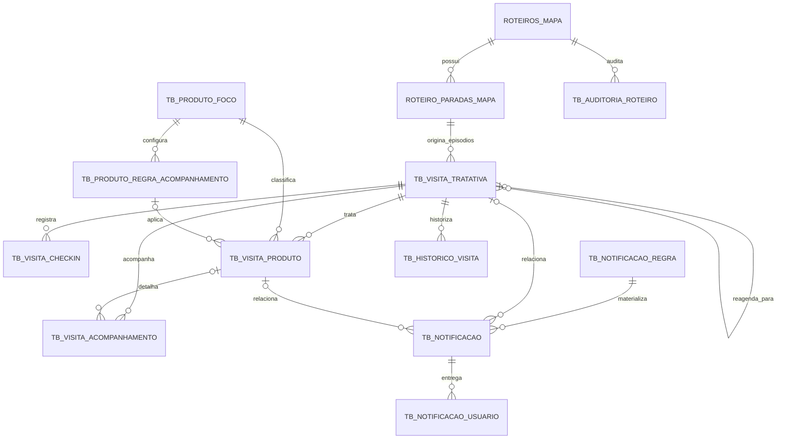

# Modelagem SQL Server

## 1. Convenções e compatibilidade

- Banco: `TESTE`, schema `dbo`.
- Novos identificadores: `BIGINT IDENTITY`, exceto catálogos pequenos com
  `INT IDENTITY`.
- O roteiro preserva o `UNIQUEIDENTIFIER` já existente.
- Instantes: `DATETIME2(3)` UTC e `SYSUTCDATETIME()`.
- Agenda local: `DATE`, `TIME(0)` e `FUSO_HORARIO`.
- Coordenadas: `DECIMAL(9,6)`.
- Distância/precisão: `DECIMAL(10,2)`.
- Indicadores: `BIT`.
- Texto de negócio: `NVARCHAR`; códigos controlados: `VARCHAR`.
- JSON somente para snapshot, configuração e evidência variável, sempre com
  `ISJSON`.
- Entidades mutáveis possuem `ROWVERSION`.
- Histórico e auditoria são append-only.
- Não há `ON DELETE CASCADE`: visita e auditoria não podem desaparecer ao
  remover acidentalmente uma entidade pai.

O script `00_ajustes_roteiros_existentes.sql` acrescenta a
`ROTEIROS_MAPA`:

- `STATUS_GESTAO VARCHAR(20)`;
- `PRIORIDADE VARCHAR(10)`;
- `ORIENTACAO NVARCHAR(1000)`;
- `ATUALIZADO_EM_UTC DATETIME2(3)`;
- `ATUALIZADO_POR INT`;
- `VERSAO_LINHA ROWVERSION`.

Também cria uma chave candidata `(ID, ROTEIRO_ID)` na parada para que a FK da
visita garanta que a parada realmente pertence ao roteiro informado.

## 2. Relacionamentos

## 3. Tabelas solicitadas

### 3.1 `TB_VISITA_TRATATIVA`

**Finalidade:** episódio operacional de uma parada. Mantém estado atual,
resposta “foi visitada?”, resultado geral e snapshots necessários para
rastreabilidade. Uma parada pode ter vários episódios por reagendamento, mas
somente um `EH_ATUAL = 1`.

| Coluna | Tipo | Uso |
|---|---|---|
| `ID` | `BIGINT IDENTITY` | PK |
| `PARADA_ROTEIRO_ID` | `BIGINT` | parada de origem |
| `ROTEIRO_ID` | `UNIQUEIDENTIFIER` | roteiro de origem |
| `VISITA_ORIGEM_ID` | `BIGINT NULL` | episódio anterior |
| `SEQUENCIA` | `SMALLINT` | número da tentativa |
| `EH_ATUAL` | `BIT` | episódio corrente |
| `CHAVE_LOJA` | `NVARCHAR(100)` | snapshot da loja |
| `NOME_LOJA` | `NVARCHAR(250)` | snapshot do nome |
| `COD_AG` | `NVARCHAR(20) NULL` | agência |
| `CHAVE_SUPERVISAO` | `INT` | território/escopo |
| `ENDERECO` | `NVARCHAR(500) NULL` | endereço planejado |
| `COD_FUNC_RESPONSAVEL` | `INT` | responsável |
| `NOME_RESPONSAVEL` | `NVARCHAR(150)` | snapshot |
| `COD_FUNC_CRIADOR` | `INT` | criador/sugeridor |
| `NOME_CRIADOR` | `NVARCHAR(150)` | snapshot |
| `DATA_PLANEJADA` | `DATE` | data comercial local |
| `HORARIO_PLANEJADO` | `TIME(0) NULL` | hora local |
| `FUSO_HORARIO` | `VARCHAR(64)` | IANA timezone |
| `PRIORIDADE` | `VARCHAR(10)` | baixa a crítica |
| `ORIENTACAO` | `NVARCHAR(1000) NULL` | orientação da atribuição |
| `STATUS` | `VARCHAR(20)` | estado operacional |
| `RESPOSTA_REALIZACAO` | `VARCHAR(20) NULL` | sim/não/reagendada |
| `RESULTADO_COMERCIAL` | `VARCHAR(30)` | resultado geral separado |
| `DATA_VISITA` | `DATE NULL` | data local efetiva |
| `INICIO_EM_UTC` | `DATETIME2(3) NULL` | início efetivo |
| `TERMINO_EM_UTC` | `DATETIME2(3) NULL` | término opcional |
| `MOTIVO_NAO_REALIZACAO` | `VARCHAR(40) NULL` | motivo controlado |
| `JUSTIFICATIVA_NAO_REALIZACAO` | `NVARCHAR(1000) NULL` | obrigatória em “Outro” |
| `OBSERVACAO_GERAL` | `NVARCHAR(2000) NULL` | observação |
| `NECESSITA_RETORNO` | `BIT` | indicador |
| `DATA_PREVISTA_RETORNO` | `DATE NULL` | retorno local |
| `SALVO_PARCIAL_EM_UTC` | `DATETIME2(3) NULL` | último rascunho |
| `FINALIZADA_EM_UTC` | `DATETIME2(3) NULL` | terminal |
| `FINALIZADA_POR` | `INT NULL` | ator terminal |
| `CRIADO_EM_UTC`, `ATUALIZADO_EM_UTC` | `DATETIME2(3)` | auditoria |
| `CRIADO_POR`, `ATUALIZADO_POR` | `INT` | auditoria |
| `VERSAO_LINHA` | `ROWVERSION` | concorrência |

**PK:** `ID`.

**FKs:** parada+roteiro, roteiro e auto-FK `VISITA_ORIGEM_ID`.

**Índices:** único por parada+sequência; único filtrado por parada atual;
responsável+status+data; roteiro+status; loja+data; supervisão+data.

**Integridade:** checks de status, prioridade, resultado, período,
justificativa de “Outro” e campos obrigatórios dos estados terminais.

### 3.2 `TB_VISITA_CHECKIN`

**Finalidade:** evidência de check-in/check-out, com horário do dispositivo,
horário do servidor e validação de localização.

| Coluna | Tipo | Uso |
|---|---|---|
| `ID` | `BIGINT IDENTITY` | PK |
| `VISITA_ID` | `BIGINT` | visita |
| `TIPO` | `VARCHAR(10)` | check-in/check-out |
| `DATA_HORA_DISPOSITIVO_UTC` | `DATETIME2(3)` | instante convertido |
| `DATA_HORA_SERVIDOR_UTC` | `DATETIME2(3)` | recebimento confiável |
| `FUSO_OFFSET_MINUTOS` | `SMALLINT` | offset recebido |
| `COD_FUNC_USUARIO` | `INT` | ator |
| `LATITUDE`, `LONGITUDE` | `DECIMAL(9,6) NULL` | posição informada |
| `PRECISAO_METROS` | `DECIMAL(10,2) NULL` | precisão |
| `LATITUDE_LOJA`, `LONGITUDE_LOJA` | `DECIMAL(9,6) NULL` | snapshot da referência |
| `DISTANCIA_METROS` | `DECIMAL(10,2) NULL` | cálculo do servidor |
| `RAIO_PERMITIDO_METROS` | `DECIMAL(10,2) NULL` | regra aplicada |
| `STATUS_VALIDACAO` | `VARCHAR(30)` | validação |
| `ORIGEM` | `VARCHAR(20)` | GPS/rede/manual/offline |
| `JUSTIFICATIVA_EXCECAO` | `NVARCHAR(1000) NULL` | exceção |
| `DISPOSITIVO_EVENTO_ID` | `VARCHAR(100)` | idempotência do aparelho |
| `RECEBIDO_COM_ATRASO` | `BIT` | sinal offline |
| `VALIDADO_EM_UTC` | `DATETIME2(3) NULL` | revisão |
| `VALIDADO_POR` | `INT NULL` | revisor |
| `CRIADO_EM_UTC` | `DATETIME2(3)` | auditoria |
| `VERSAO_LINHA` | `ROWVERSION` | concorrência |

**PK/FKs:** PK `ID`; FK `VISITA_ID`.

**Índices:** único visita+tipo; único evento do dispositivo; usuário+data;
estado de validação.

**Relacionamento:** uma visita tem no máximo um check-in e um check-out.

### 3.3 `TB_VISITA_PRODUTO`

**Finalidade:** tratativa e evolução de cada produto foco.

| Coluna | Tipo | Uso |
|---|---|---|
| `ID` | `BIGINT IDENTITY` | PK |
| `VISITA_ID` | `BIGINT` | visita |
| `PRODUTO_ID` | `INT` | catálogo |
| `REGRA_ACOMPANHAMENTO_ID` | `BIGINT NULL` | regra congelada |
| `CODIGO_PRODUTO_SNAPSHOT` | `VARCHAR(40)` | snapshot |
| `NOME_PRODUTO_SNAPSHOT` | `NVARCHAR(100)` | snapshot |
| `TIPO_OPORTUNIDADE` | `VARCHAR(50)` | seletor de regra |
| `OPORTUNIDADE_SNAPSHOT_JSON` | `NVARCHAR(MAX)` | origem |
| `STATUS_TRATATIVA` | `VARCHAR(20)` | pendente/tratado/não abordado |
| `RESULTADO_VISITA` | `VARCHAR(30) NULL` | resultado individual |
| `OBSERVACAO` | `NVARCHAR(2000) NULL` | observação |
| `JUSTIFICATIVA_NAO_ABORDADO` | `NVARCHAR(1000) NULL` | justificativa |
| `NECESSITA_ACOMPANHAMENTO` | `BIT` | escolha do usuário |
| `STATUS_ACOMPANHAMENTO` | `VARCHAR(30)` | estado pós-visita |
| `BASELINE_JSON` | `NVARCHAR(MAX) NULL` | evidência inicial |
| `BASELINE_EM_UTC` | `DATETIME2(3) NULL` | instante do baseline |
| `EVIDENCIA_ATUAL_JSON` | `NVARCHAR(MAX) NULL` | última evidência |
| `ULTIMA_VERIFICACAO_EM_UTC` | `DATETIME2(3) NULL` | avaliação |
| `PROXIMA_VERIFICACAO_EM_UTC` | `DATETIME2(3) NULL` | fila do job |
| `EVOLUCAO_DETECTADA_EM_UTC` | `DATETIME2(3) NULL` | sucesso |
| `RESUMO_EVIDENCIA` | `NVARCHAR(1000) NULL` | explicação |
| `TENTATIVAS_TECNICAS` | `SMALLINT` | retry |
| `BLOQUEADO_ATE_EM_UTC` | `DATETIME2(3) NULL` | lease |
| `BLOQUEADO_POR_WORKER` | `VARCHAR(100) NULL` | worker |
| `ULTIMO_ERRO_TECNICO` | `NVARCHAR(2000) NULL` | diagnóstico |
| `TRATADO_EM_UTC` | `DATETIME2(3) NULL` | auditoria |
| `TRATADO_POR` | `INT NULL` | ator |
| `CRIADO_EM_UTC`, `ATUALIZADO_EM_UTC` | `DATETIME2(3)` | auditoria |
| `CRIADO_POR`, `ATUALIZADO_POR` | `INT` | auditoria |
| `VERSAO_LINHA` | `ROWVERSION` | concorrência |

**PK/FKs:** PK `ID`; FKs para visita, produto e regra.

**Índices:** único visita+produto; visita+tratativa; status+próxima verificação;
produto+acompanhamento.

**Integridade:** JSON válido; resultado de não abordado e justificativa
coerentes; tratado exige ator e instante.

### 3.4 `TB_VISITA_REAGENDAMENTO`

**Finalidade:** elo imutável entre o episódio encerrado e o novo.

| Coluna | Tipo |
|---|---|
| `ID` | `BIGINT IDENTITY` |
| `VISITA_ORIGEM_ID`, `VISITA_NOVA_ID` | `BIGINT` |
| `DATA_ANTERIOR`, `NOVA_DATA` | `DATE` |
| `HORARIO_ANTERIOR`, `NOVO_HORARIO` | `TIME(0) NULL` |
| `MOTIVO` | `VARCHAR(40)` |
| `JUSTIFICATIVA`, `ORIENTACAO` | `NVARCHAR(1000) NULL` |
| `PRIORIDADE` | `VARCHAR(10)` |
| `REAGENDADO_EM_UTC` | `DATETIME2(3)` |
| `REAGENDADO_POR` | `INT` |
| `CORRELATION_ID` | `UNIQUEIDENTIFIER` |

**PK/FKs:** PK `ID`; FKs para visita anterior e nova; ambas únicas.

**Índice:** nova data/hora. Checks impedem autoelo, motivo inválido e nova data
anterior.

### 3.5 `TB_VISITA_ACOMPANHAMENTO`

**Finalidade:** contatos, comentários, adiamentos, validações automáticas,
reagendamentos de contato e encerramento sem continuidade.

| Coluna | Tipo |
|---|---|
| `ID` | `BIGINT IDENTITY` |
| `VISITA_ID` | `BIGINT` |
| `VISITA_PRODUTO_ID`, `NOTIFICACAO_ORIGEM_ID` | `BIGINT NULL` |
| `TIPO` | `VARCHAR(30)` |
| `ACAO` | `VARCHAR(50)` |
| `STATUS` | `VARCHAR(20)` |
| `OBSERVACAO` | `NVARCHAR(2000)` |
| `EVIDENCIA_JSON` | `NVARCHAR(MAX) NULL` |
| `PROXIMA_ACAO_EM_UTC`, `REALIZADO_EM_UTC` | `DATETIME2(3) NULL` |
| `RESULTADO` | `VARCHAR(50) NULL` |
| `COD_FUNC_RESPONSAVEL` | `INT NULL` |
| `CRIADO_EM_UTC`, `ATUALIZADO_EM_UTC` | `DATETIME2(3)` |
| `CRIADO_POR`, `ATUALIZADO_POR` | `INT` |
| `VERSAO_LINHA` | `ROWVERSION` |

**PK/FKs:** PK `ID`; FKs para visita, produto opcional e notificação de origem.

**Índices:** timeline da visita; produto+status+próxima ação;
responsável+status+próxima ação.

### 3.6 `TB_NOTIFICACAO`

**Finalidade:** ocorrência lógica de negócio, independente do estado de cada
destinatário.

| Coluna | Tipo |
|---|---|
| `ID` | `BIGINT IDENTITY` |
| `REGRA_ID` | `BIGINT` |
| `TIPO` | `VARCHAR(60)` |
| `TITULO` | `NVARCHAR(200)` |
| `MENSAGEM` | `NVARCHAR(1000)` |
| `PRIORIDADE` | `VARCHAR(10)` |
| `STATUS` | `VARCHAR(15)` |
| `ENTIDADE_TIPO` | `VARCHAR(30)` |
| `ENTIDADE_ID` | `NVARCHAR(100)` |
| `ROTEIRO_ID` | `UNIQUEIDENTIFIER NULL` |
| `VISITA_ID`, `VISITA_PRODUTO_ID` | `BIGINT NULL` |
| `CHAVE_LOJA` | `NVARCHAR(100) NULL` |
| `CHAVE_DEDUPLICACAO` | `NVARCHAR(250)` |
| `ACAO_DESTINO` | `VARCHAR(80)` |
| `DESTINO_JSON`, `ACOES_JSON` | `NVARCHAR(MAX)` |
| `COD_FUNC_ORIGEM` | `INT NULL` |
| `EVENTO_ORIGEM_ID`, `CORRELATION_ID` | `UNIQUEIDENTIFIER` |
| `CRIADO_EM_UTC`, `DISPONIVEL_EM_UTC` | `DATETIME2(3)` |
| `EXPIRA_EM_UTC`, `RESOLVIDA_EM_UTC` | `DATETIME2(3) NULL` |
| `RESOLVIDA_POR` | `INT NULL` |
| `MOTIVO_RESOLUCAO` | `VARCHAR(60) NULL` |
| `VERSAO_LINHA` | `ROWVERSION` |

**PK/FKs:** PK `ID`; FKs para regra, roteiro, visita e produto quando
aplicáveis.

**Unicidade:** chave de deduplicação e evento de origem.

**Índices:** status+data; visita; roteiro; loja.

### 3.7 `TB_NOTIFICACAO_USUARIO`

**Finalidade:** entrega e estado individual. É aqui que ficam destinatário,
leitura, adiamento, ciência e ação.

| Coluna | Tipo |
|---|---|
| `ID` | `BIGINT IDENTITY` |
| `NOTIFICACAO_ID` | `BIGINT` |
| `COD_FUNC_DESTINATARIO` | `INT` |
| `STATUS` | `VARCHAR(15)` |
| `PRIMEIRA_ENTREGA_EM_UTC`, `ULTIMA_ENTREGA_EM_UTC` | `DATETIME2(3)` |
| `QTD_ENTREGAS` | `SMALLINT` |
| `VISUALIZADA_EM_UTC`, `LIDA_EM_UTC`, `CIENCIA_EM_UTC` | `DATETIME2(3) NULL` |
| `ADIADA_ATE_EM_UTC` | `DATETIME2(3) NULL` |
| `QTD_ADIAMENTOS` | `SMALLINT` |
| `RESOLVIDA_EM_UTC`, `ARQUIVADA_EM_UTC` | `DATETIME2(3) NULL` |
| `ACAO_EXECUTADA` | `VARCHAR(80) NULL` |
| `ACAO_EXECUTADA_EM_UTC`, `ESCALADA_EM_UTC` | `DATETIME2(3) NULL` |
| `ATUALIZADO_EM_UTC` | `DATETIME2(3)` |
| `ATUALIZADO_POR` | `INT` |
| `VERSAO_LINHA` | `ROWVERSION` |

**PK/FK:** PK `ID`; FK para notificação.

**Unicidade:** notificação+destinatário.

**Índices:** caixa do destinatário; não lidas; adiadas vencendo.

### 3.8 `TB_HISTORICO_VISITA`

**Finalidade:** timeline append-only de todos os eventos da visita.

| Coluna | Tipo |
|---|---|
| `ID` | `BIGINT IDENTITY` |
| `VISITA_ID` | `BIGINT` |
| `VISITA_PRODUTO_ID`, `CHECKIN_ID`, `NOTIFICACAO_ID` | `BIGINT NULL` |
| `TIPO_EVENTO` | `VARCHAR(80)` |
| `STATUS_ANTERIOR`, `STATUS_NOVO` | `VARCHAR(30) NULL` |
| `DADOS_ANTERIORES_JSON`, `DADOS_NOVOS_JSON` | `NVARCHAR(MAX) NULL` |
| `MOTIVO` | `NVARCHAR(1000) NULL` |
| `COD_FUNC_ATOR` | `INT NULL` |
| `ORIGEM` | `VARCHAR(20)` |
| `OCORRIDO_EM_UTC` | `DATETIME2(3)` |
| `CORRELATION_ID` | `UNIQUEIDENTIFIER` |
| `REQUEST_ID` | `UNIQUEIDENTIFIER NULL` |
| `IP_ADDRESS` | `VARCHAR(45) NULL` |
| `USER_AGENT` | `NVARCHAR(500) NULL` |

**PK/FKs:** PK `ID`; FKs para visita, produto, check-in e notificação.

**Índices:** timeline; ator+data; correlação.

**Auditoria:** trigger recusa `UPDATE` e `DELETE`. Alterações sempre geram nova
linha.

### 3.9 `TB_AUDITORIA_ROTEIRO`

**Finalidade:** trilha append-only de criação, atribuição e alterações do
roteiro/parada.

| Coluna | Tipo |
|---|---|
| `ID` | `BIGINT IDENTITY` |
| `ROTEIRO_ID` | `UNIQUEIDENTIFIER` |
| `PARADA_ROTEIRO_ID` | `BIGINT NULL` |
| `TIPO_EVENTO` | `VARCHAR(80)` |
| `CAMPO_ALTERADO` | `VARCHAR(80) NULL` |
| `DADOS_ANTERIORES_JSON`, `DADOS_NOVOS_JSON` | `NVARCHAR(MAX) NULL` |
| `MOTIVO` | `NVARCHAR(1000) NULL` |
| `PRIORIDADE_ANTERIOR`, `PRIORIDADE_NOVA` | `VARCHAR(10) NULL` |
| `COD_FUNC_ATOR` | `INT` |
| `ORIGEM` | `VARCHAR(20)` |
| `OCORRIDO_EM_UTC` | `DATETIME2(3)` |
| `CORRELATION_ID` | `UNIQUEIDENTIFIER` |
| `REQUEST_ID` | `UNIQUEIDENTIFIER NULL` |
| `IP_ADDRESS` | `VARCHAR(45) NULL` |
| `USER_AGENT` | `NVARCHAR(500) NULL` |

**PK/FKs:** PK `ID`; FKs para roteiro e parada opcional.

**Índices:** timeline; ator+data; correlação.

**Auditoria:** trigger recusa `UPDATE` e `DELETE`.

## 4. Tabelas de suporte necessárias

### 4.1 `TB_PRODUTO_FOCO`

Catálogo extensível. Colunas: `ID INT IDENTITY` (PK), `CODIGO VARCHAR(40)`
único, `NOME NVARCHAR(100)`, `DESCRICAO NVARCHAR(500)`,
`ESTRATEGIA_VALIDACAO VARCHAR(60)`, `ATIVO BIT`, campos de criação/atualização
e `ROWVERSION`. Índice por ativo+nome.

### 4.2 `TB_PRODUTO_REGRA_ACOMPANHAMENTO`

Regra configurável por produto e tipo de oportunidade.

Colunas: `ID BIGINT IDENTITY` (PK), `PRODUTO_ID INT` (FK),
`TIPO_OPORTUNIDADE VARCHAR(50)`, `PRAZO_DIAS SMALLINT`, `DIAS_UTEIS BIT`,
`HORA_EXECUCAO_LOCAL TIME(0)`, limites de tentativa/reavaliação/adiamento,
`ESTRATEGIA_VALIDACAO VARCHAR(60)`, `PARAMETROS_JSON NVARCHAR(MAX)`,
`VERSAO_REGRA INT`, vigência, ativo, auditoria e `ROWVERSION`.

Índices: uma regra ativa por produto+oportunidade; unicidade de versão; busca
por vigência.

### 4.3 `TB_NOTIFICACAO_REGRA`

Regra versionada de materialização. Colunas: `ID BIGINT IDENTITY` (PK), código,
versão, tipo, evento gatilho, prioridade, atraso e expiração, templates,
políticas JSON, ações/canais JSON, vigência, ativo, auditoria e `ROWVERSION`.

Índices: código+versão; uma versão ativa por código; evento+vigência.

### 4.4 `TB_EVENTO_OUTBOX`

Fila transacional. Colunas: `ID BIGINT IDENTITY` (PK),
`EVENTO_ID UNIQUEIDENTIFIER` único, tipo, agregado, payload JSON, correlação,
instante do fato, disponibilidade, status, tentativas, lease, processamento,
erro e criação.

Índices: status+disponibilidade para worker; agregado+data para rastreio.

## 5. Integridade de usuários

Não existe hoje uma única dimensão física de usuários operacionais:

- `users_map` guarda administradores, usa `COD_FUNC NVARCHAR(20)` e role curta;
- perfis operacionais vêm de `TB_COORD_GA`, `TB_COORD_COORDENADOR` e
  `TB_COORD_SUP`;
- autenticação resolve o maior papel e o escopo no backend.

Por isso, códigos funcionais novos são `INT`, mas não possuem FK para
`users_map`. A integridade é aplicada pelo resolvedor de identidade no comando
e preservada por snapshot de nome quando a legibilidade histórica exige. O
valor `0` é reservado aos seeds/eventos do sistema.

## 6. Consultas prioritárias cobertas

- caixa por usuário, status e data;
- contador de não lidas;
- visita por responsável, status e data;
- roteiro e progresso das paradas;
- histórico por loja;
- timeline por visita/roteiro;
- produtos vencidos para avaliação;
- acompanhamentos por responsável e próxima ação;
- validações de check-in pendentes;
- outbox pronta para processamento;
- deduplicação por ocorrência.

O arquivo
[`03_validacao_pos_deploy.sql`](../../create_table/03_validacao_pos_deploy.sql)
verifica objetos, constraints não confiáveis, duplicidades, visitas concluídas
com produto pendente e alertas ativos para entidades terminais.
